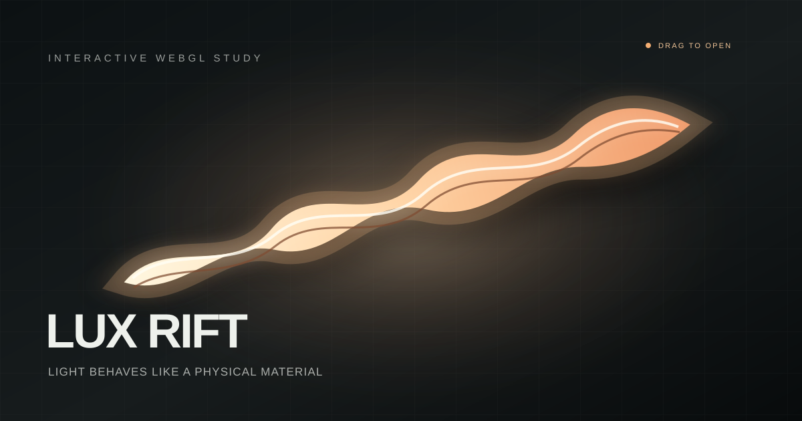

# Lux Rift

**一個互動式 WebGL 光影實驗：拉開具有彈性的黑曜遮光膜，讓大面積光源、柔和半影與慣性運動從裂隙中顯現。**

[線上展示](https://slivenred.github.io/lux-rift/) · [English](README.md)



## 創作概念

Lux Rift 不把黑暗視為空白背景，而是把它設計成一種可以被拉伸、撕開與震盪的物理材質。按住畫面並拖曳，就能拉出一道發光裂隙；遮光膜會產生厚度、折痕與柔和半影，放開後仍會依照速度與角動量繼續運動。

畫面底層是真正的 HTML 介面，上層則是透明 WebGL 畫布。內容仍可保持響應式排版，Shader 專門負責遮光膜、光線穿透、邊緣折疊、細微色散與曝光效果。

## 特色

- 依照拖曳速度與距離產生不規則彈性裂隙
- 大面積光源、寬廣半影與電影式色調映射
- 放開後保留彈簧、阻尼、平移與旋轉慣性
- 多種光譜與遮光膜材質
- 支援桌面滑鼠與手機觸控
- 支援 reduced motion 偏好
- 不使用框架、第三方套件、外部字型或執行階段網路請求
- 使用原生 HTML、CSS 與 JavaScript，不需要建置流程

## 操作方式

| 操作 | 功能 |
| --- | --- |
| 按住並拖曳 | 拉開並改變裂隙方向 |
| 放開 | 讓遮光膜依慣性震盪 |
| 單擊 | 產生短促裂光脈衝 |
| 雙擊 | 重設構圖 |
| 滑鼠滾輪 | 調整曝光 |
| `S` | 切換光譜 |
| `M` | 切換遮光膜材質 |
| `R` | 重設 |
| `+` / `-` | 增加或降低曝光 |

## 技術架構

Lux Rift 分成三層：

1. **原生 DOM**：顯示底層的編輯式氣象檔案介面。
2. **WebGL Shader**：計算裂隙距離場、程序式邊緣、膜面折痕、厚度、半影、色散與曝光。
3. **JavaScript 運動系統**：將手勢轉換成彈簧位移、線速度、角速度、阻尼與衰減。

WebGL Canvas 保持透明且不攔截指標事件，因此底層內容仍是真正的 HTML，而不是被截圖後貼成材質。

## 本機執行

不需要建置流程，可以直接開啟 `index.html`，或在資料夾中啟動本機伺服器：

```bash
python3 -m http.server 8080
```

接著開啟 `http://localhost:8080`。

可執行以下指令檢查公開專案結構：

```bash
node scripts/validate.mjs
```

## 自訂方向

專案刻意維持精簡，主要可從以下檔案調整：

- `styles.css` 的 CSS 變數：底層介面配色
- `app.js` 的 `spectrumButton`：光譜預設
- `app.js` 的 `materialButton`：遮光膜材質預設
- `app.js` 的 `uExposure`：光線強度
- `shaders.js` 中的 `riftField()`：裂隙形狀與柔邊
- `app.js` 後段的手勢事件：物理運動手感

## 瀏覽器支援

需要啟用 JavaScript 與 WebGL，適用於目前主流桌面與手機瀏覽器。當 WebGL 無法初始化時，頁面會顯示清楚的替代訊息。

## 參與貢獻

歡迎提交錯誤回報、互動創意、Shader 改善與無障礙修正，請閱讀 [CONTRIBUTING.md](CONTRIBUTING.md)。

## 授權

本專案採用 [MIT License](LICENSE)。

由 [SlivenRed](https://github.com/slivenred) 創作。
